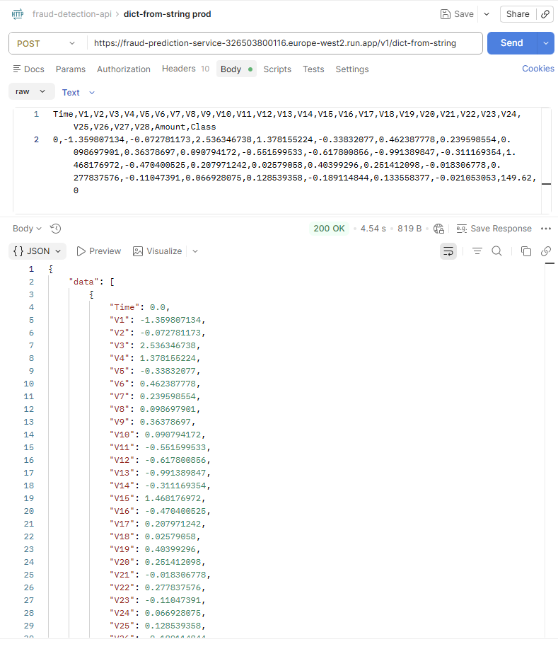
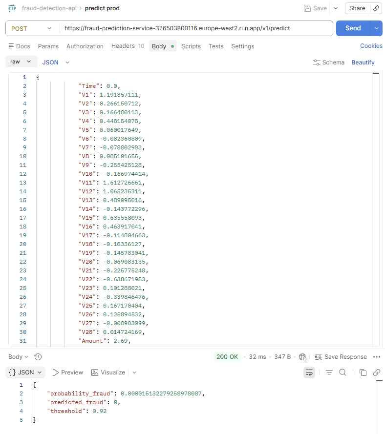

# Credit Card Fraud Prediction API
## Personal project

## Project description
1. For Fraud Prediction API, the input and output are Json object  
   https://fraud-prediction-service-326503800116.europe-west2.run.app/v1/predict
2. Offer an utility API, to convert CSV to Json object which can be passed on to the Prediction API  
   https://fraud-prediction-service-326503800116.europe-west2.run.app/v1/dict-from-string
3. Demo page for easy demonstration of how both of the APIs can be used  
   https://fraud-prediction-service-326503800116.europe-west2.run.app/demo
4. Service health check endpoint  
   https://fraud-prediction-service-326503800116.europe-west2.run.app/health

---------------------------

## Model Training & Artifacts & Deployment
1. Use Kaggle's Credit Card Fraud Detection dataset:  
   https://www.kaggle.com/datasets/mlg-ulb/creditcardfraud?resource=download
2. Compare the fraud prediction performance between:
   LogisticRegression,
   RandomForestClassifier,
   HistGradientBoostingClassifier,
   XGBClassifier
3. Evaluate using F1 Score and PR-AUC. Select XGBClassifier as a model to serve the API

### Where Artifacts Go
The production API requires two files inside the `api/` directory:
1. `api/model.joblib` — The serialized trained model object (e.g., RandomForest, LogisticRegression).
2. `api/metadata.json` — Accompanying training metadata, thresholds, or feature engineering configurations.

### How to Train and Update
When training a new model version:
1. Run your training notebook/script locally or in your pipeline.
2. Export the final model artifact using `joblib`:
   ```python
   import joblib
   joblib.dump(trained_model, "api/model.joblib")

### Build the RESTful API Server
FastAPI server with Pydantic to validate the payload

### Deployment
Deployed to Google Cloud Run

### Postman
1. Convert CSV to Json
   
2. Predict
   